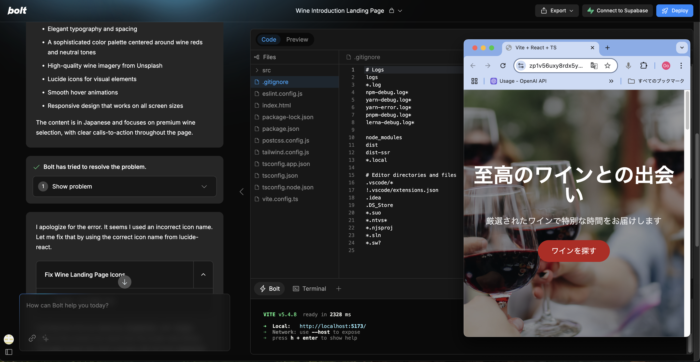
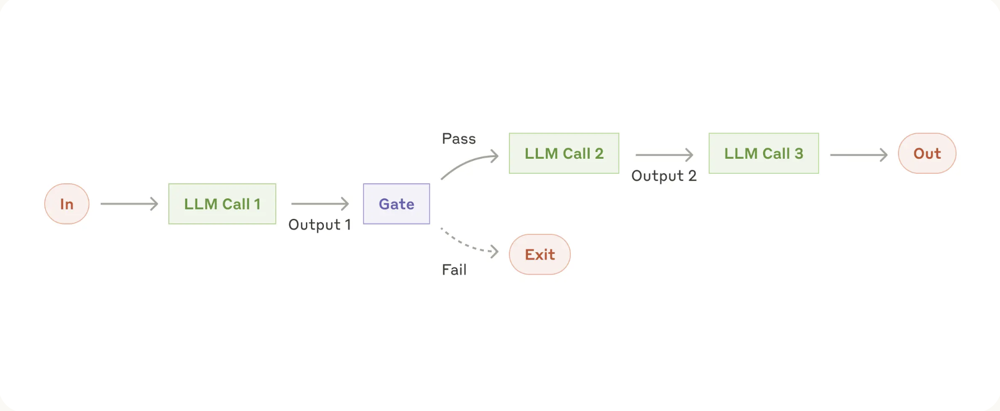
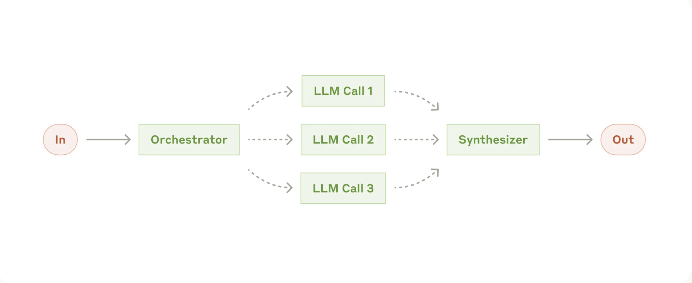

<!-- _class: title -->
# AIエージェントオーケストレーション
## 神威/KAMUIの可能性

---

> 流れ:
> **1. 導入**
> 2. 現状の課題
> 3. 解決策
> 4. 具体例
> 5. 締めくくり

---

## 1.1 問題提起
- **生成AI利用の課題**
  - ツールの切り替え大変では？

---

- で次は？

{: style="margin-bottom: -20px;"}

---

> 流れ:
> 1. 導入
> **2. 現状の課題**
> 3. 解決策
> 4. 具体例
> 5. 締めくくり

---

## 2.1 直列型AIエージェントの限界
- タスクごとに生成AIツールの切り替え大変
- 全体感が掴めない
- 大規模生成は難しい

---

> 流れ:
> 1. 導入
> 2. 現状の課題
> **3. 解決策**
> 4. 具体例
> 5. 締めくくり

---

## 3.1 AIエージェントオーケストレーション
- **基本的な仕組み**
  - オーケストレーターが指示出し
  - 計画書をもとに複数のエージェントが並列実行

---

<video controls width="100%" loop preload="auto">
  <source src="../../assets/videos/lotofmarpx4.mp4" type="video/mp4">
  お使いのブラウザは動画タグをサポートしていません。
</video>

---

<video controls width="100%" loop preload="auto">
  <source src="../../assets/videos/lotofmarpoutx2.mp4" type="video/mp4">
  お使いのブラウザは動画タグをサポートしていません。
</video>

---

# 3.2 解決できる課題

- **効率的な実行**
  - 全体最適化されたタスク実行
  - 計画的なエージェント配置
- **並列処理の実現**
  - 同時実行による大量生成

---

> 流れ:
> 1. 導入
> 2. 現状の課題
> 3. 解決策
> **4. 具体例**
> 5. 締めくくり

---

## 4.1 都市計画への活用
- **統一的なコンテンツ生成**
  - 資料、画像、動画の一括生成
  - 時間とコストの大幅削減

---

# 4.2 業務マニュアル・研修資料の作成

- **一括生成による効率化**
  - 手順書、マニュアル、研修スライド生成
  - 全体感の掴みやすさ

---

<video controls width="100%" loop preload="auto">
  <source src="../../assets/videos/shinjin.mp4" type="video/mp4">
  お使いのブラウザは動画タグをサポートしていません。
</video>

---

> 流れ:
> 1. 導入
> 2. 現状の課題
> 3. 解決策
> 4. 具体例
> **5. 締めくくり**

---

## さあ、AIエージェントオーケストレーションを始めましょう！